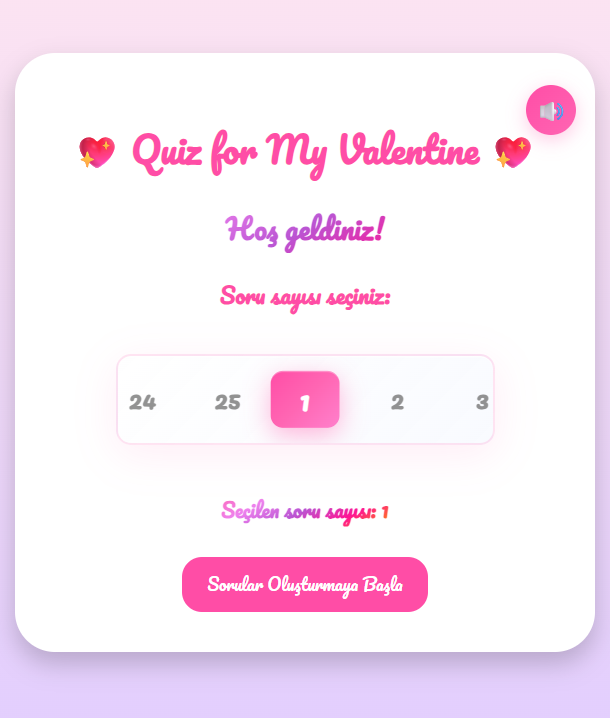
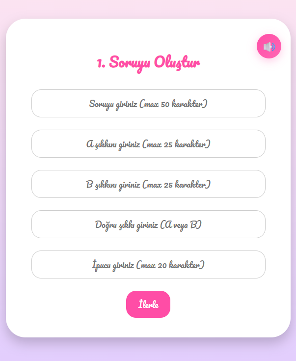

# Quiz for My Valentine

Çiftler için basit ve tatlı bir bilgi yarışması oyunu.

## Özellikler
- Havalı bir spinner ile 1-25 arası soru oluşturma
- Animasyonlu soru kartları
- Uyumluluk analizi
- Ses efektleri

## Teknolojiler
- Vanilla JavaScript
- HTML5 / CSS3
- Web Audio API

## Nasıl Oynanır?
- Açılış ekranında bulunan döndürücü ile 1-25 arası soru seçiniz.
- Seçtiğiniz soru sayısı kadar soru oluşturmaya başlayınız.
- Sorularınıza seçeneklerinizi giriniz ve doğru seçeneğinizi belirleyiniz.
- Partnerinize yardımcı olmak için sorularınıza ipucu giriniz ☻
- Hazır olduğunuzda testi partnerinize çözdürmeye başlayabilirsiniz!
- Her doğru cevap için +1 puan kazanırsınız. Yanlış cevap da ise bir kayıp yaşamazsınız.
- Test bittiğinde karşınıza gelen "Uyumluluk Analizi" kartı ile skorunuzu ve partnerinizle olan uyumunuzu öğrenebilirsiniz!
- "Tekrar Oyna" butonu ile yeniden test hazırlamaya başlayabilirsiniz.
- İstediğiniz an ekranın sağ üstünde bulunan ses açma/kapama butonu ile sesi kontrol edebilirsiniz.
- Tüm bunlara ek oyun boyunca devam eden tatlı ve romantik animasyonlarla eğlenceniz katlanır!
- İYİ EĞLENCELER ♥

<table>
  <tr>
    <td></td>
    <td></td>
  </tr>
  <tr>
    <td align="center">1</td>
    <td align="center">2</td>
  </tr>
</table>

